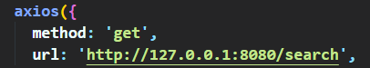
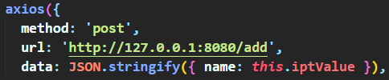
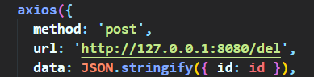
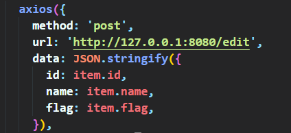

# **这里的全部请求方式是基于axios的 所以请不要发送$.Ajax请求**

## 1.查询内容

请求地址:  http://127.0.0.1:8080/search

请求方式: get

请求参数: 无

返回数据:

| 名称 |  类型  |    说明    |
| :--: | :----: | :--------: |
| code | Number |   状态码   |
| msg  | String |    提示    |
| data | Array  | 获取的数据 |

## 2.添加内容

请求地址: http://127.0.0.1:8080/add

请求方式: post

请求参数: **注意需要通过JSON.stringify转化 例如 data:  JSON.stringify({name: 你要传的值}) 如下图中的data**

| 名称 |  类型  |      说明      |
| :--: | :----: | :------------: |
| name | String | 要添加的name值 |

返回数据:

| 名称 |  类型  |     说明     |
| :--: | :----: | :----------: |
| code | Number |    状态码    |
| msg  | String |     提示     |
| data | Array  | 添加后的数据 |

## 3.删除内容

请求地址: http://127.0.0.1:8080/del

请求方式: post

请求参数: **同理需要通过JSON.stringify转化 **

| 名称 |  类型  |    说明    |
| :--: | :----: | :--------: |
|  id  | Number | 要删除的id |

返回数据:

| 名称 |  类型  |     说明     |
| :--: | :----: | :----------: |
| code | Number |    状态码    |
| msg  | String |     提示     |
| data | Array  | 删除后的数据 |

## 4.修改内容

请求地址: http://127.0.0.1:8080/edit

请求方式: post

请求参数: **同理需要通过JSON.stringify转化 **

| 名称 |  类型   |     说明     |
| :--: | :-----: | :----------: |
|  id  | Number  |  要修改的id  |
| name | String  | 要修改的name |
| flag | boolean | 要修改的状态 |

返回数据:

| 名称 |  类型  |     说明     |
| :--: | :----: | :----------: |
| code | Number |    状态码    |
| msg  | String |     提示     |
| data | Array  | 修改后的数据 |

